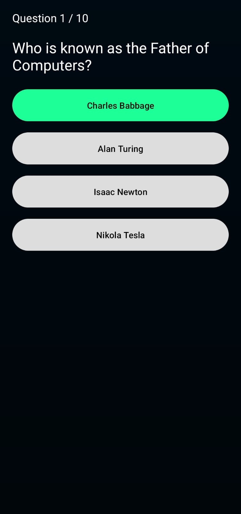
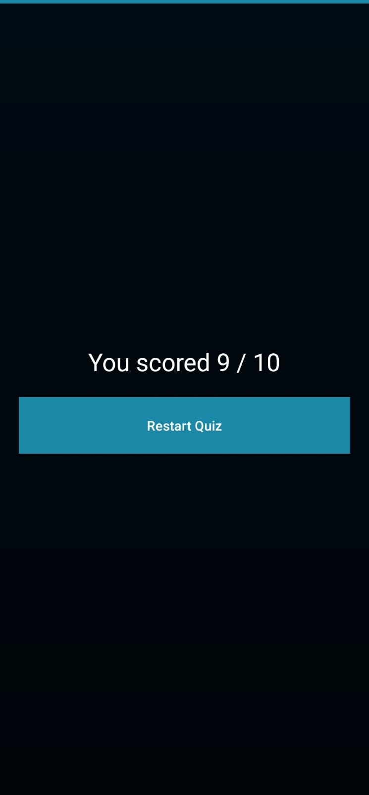

<div align="center">
  

  <h1>Quizify App</h1>
  <p>
    <b>OIBSIP Task 4</b> - Android Development Internship
  </p>

  <a href="https://github.com/Adithyanps47/oibsip-task4-quiz-app">
    
  </a>
  <a href="https://developer.android.com/">
    
  </a>
  <a href="https://developer.android.com/studio">
    
  </a>
  <a href="#">
    
  </a>
</div>

<br />

## 📖 About
This Android application was developed as part of the **Oasis Infobyte Android Development Internship** (OIBSIP). **Quizify** is a clean, interactive General Knowledge quiz application built to test your trivia skills with a responsive and visually appealing interface.

## 🚀 Features
The app offers a seamless quizzing experience:
* **10-Question Challenge:** A curated set of General Knowledge questions to test your wits.
* **Interactive Feedback:** Immediate visual cues (Green for Correct, Red for Wrong) upon selecting an answer.
* **Real-time Progress:** Tracks your journey through the quiz (e.g., "Question 4 / 10").
* **Scoreboard:** A detailed result screen displaying your final score and percentage.

**Additional Highlights:**
* ✅ **Ocean Gradient Theme:** A custom, calming UI aesthetic.
* ✅ **One-Tap Restart:** Easily reset the quiz to play again.
* ✅ **Responsive Layouts:** Optimized for various screen sizes using ScrollView and ConstraintLayout.

## 📸 Screenshots
| Quiz Start Screen | Question Interface | Result Screen |
|:---:|:---:|:---:|
|  |  |  |

## 🎥 Demo
See the app in action!

[**▶️ Watch Demo Video**](docs/demo/app_demo.mp4)
<br>
*(Click above to view the screen recording inside the repository)*

> **Note:** You can also view the demonstration on my [LinkedIn Profile](https://www.linkedin.com/in/adithyan-p-s-mobile/).

## 🛠 Tech Stack
* **Language:** Java
* **UI:** XML (ConstraintLayout, ScrollView, Custom Drawables)
* **Components:** Intents, Handlers (for delays), View Binding
* **IDE:** Android Studio
* **Build System:** Gradle

## 📥 How to Run
If you want to build the project from source:

1.  **Clone the repository**
    ```bash
    git clone [https://github.com/Adithyanps47/oibsip-task4-quiz-app.git](https://github.com/Adithyanps47/oibsip-task4-quiz-app.git)
    ```
2.  **Open in Android Studio**
    * Open Android Studio -> File -> Open -> Select the cloned folder.
3.  **Sync Gradle**
    * Wait for the build dependencies to fetch.
4.  **Run**
    * Press the ▶️ Run button to launch on an Emulator or Physical Device.

## 📱 Download APK
Don't want to build it? Download the latest version directly:
[**⬇️ Download v1.0 APK**](https://github.com/Adithyanps47/oibsip-task4-quiz-app/releases)

---

## 👤 Internship Details
* **Company:** Oasis Infobyte
* **Program:** Android Development Internship
* **Task:** Task 4 (Quiz App)
* **Intern:** Adithyan P S
* **LinkedIn:** [**Adithyan P S**](https://www.linkedin.com/in/adithyan-p-s-mobile/)

---
<div align="center">
  <i>Made by Adithyan P S</i>
</div>
